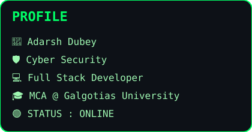
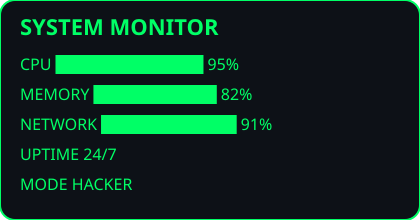

<table align="center">
<tr>

<td>



</td>

<td>



</td>

</tr>
</table>


<div align="center">


<p align="center">


</p>
</div>

---

# 💻 Cyber Terminal

```console
guest@github:~$ whoami

Adarsh Dubey

Cyber Security Developer
Full Stack Developer
MCA Student @ Galgotias University

------------------------------------------------------------

guest@github:~$ skills

✔ Python
✔ Django
✔ JavaScript
✔ HTML & CSS
✔ SQL
✔ Git
✔ Linux
✔ Cyber Security
✔ Machine Learning

------------------------------------------------------------

guest@github:~$ projects

[1] CyberHQ
    ↳ Interactive Cyberpunk Portfolio

[2] FasalMitra AI
    ↳ AI Powered Smart Agriculture Platform

[3] Add Data
    ↳ Dynamic Data Management System

[4] SilentSignal AI
    ↳ AI-Based Cyber Security Monitoring

------------------------------------------------------------

guest@github:~$ currently-working-on

> Building CyberHQ
> Learning Advanced Cyber Security
> Exploring AI & Machine Learning

------------------------------------------------------------

guest@github:~$ quote

"Code Secure. Build Smart. Never Stop Learning."

------------------------------------------------------------

guest@github:~$ exit

Session Closed Successfully...
```

# 🖥️ SYSTEM STATUS

```console
┌──────────────────────────────────────────────────────────────────────────────┐
│                                                                              │
│  USER        : Adarsh Dubey                                                  │
│                                                                              │
│  ROLE        : Cyber Security Developer                                      │
│                                                                              │
│  EDUCATION   : MCA @ Galgotias University                                    │
│                                                                              │
│  SPECIALITY  : AI • Cyber Security • Full Stack                              │
│                                                                              │
│  OS          : Kali Linux                                                    │
│                                                                              │
│  SHELL       : /bin/bash                                                     │
│                                                                              │
│  STATUS      : 🟢 ONLINE                                                     │
│                                                                              │
└──────────────────────────────────────────────────────────────────────────────┘
```

</div>
# 💻 Skill Matrix

```text
Python              ██████████████████████ 95%

Django              ███████████████████    90%

JavaScript          ████████████████       85%

HTML/CSS            █████████████████      88%

Linux               ███████████████████    92%

Git                 █████████████████      87%

MySQL               ███████████████        82%

Cyber Security      ███████████████████    93%

Machine Learning    ██████████████         78%
```
# 🚀 Featured Projects

```console
┌──────────────────────────────────────────────────────────────┐
│ 01 │ CyberHQ                                                 │
├──────────────────────────────────────────────────────────────┤
│ Interactive Cyberpunk Developer Portfolio                    │
└──────────────────────────────────────────────────────────────┘

┌──────────────────────────────────────────────────────────────┐
│ 02 │ FasalMitra AI                                           │
├──────────────────────────────────────────────────────────────┤
│ AI Powered Smart Agriculture Platform                        │
└──────────────────────────────────────────────────────────────┘

┌──────────────────────────────────────────────────────────────┐
│ 03 │ Add Data                                                │
├──────────────────────────────────────────────────────────────┤
│ Dynamic Data Management Platform                             │
└──────────────────────────────────────────────────────────────┘

┌──────────────────────────────────────────────────────────────┐
│ 04 │ SilentSignal AI                                         │
├──────────────────────────────────────────────────────────────┤
│ AI Based Cyber Security Monitoring                           │
└──────────────────────────────────────────────────────────────┘
```

# 📊 Developer Dashboard

<div align="center">


</div>

<br>

<div align="center">


</div>

## 📈 Contribution Graph

<div align="center">


</div>

## 🐍 Contribution Snake

<div align="center">


</div>

# 🏆 Trophy Room

<div align="center">


</div>

# 🐍 Contribution Snake

> Coming in the next step...

---

# 📡 Contact Terminal

```console
guest@github:~$ contact

GitHub      : https://github.com/Adarshdubey888

Portfolio   : CyberHQ (Coming Soon)

LinkedIn    : https://www.linkedin.com/in/adarsh-dubey-a46a80295/

Email       : adarshdubey8889@gmail.com

Location    : India
```

<div align="center">

```text
═══════════════════════════════════════════════════════════════

SYSTEM STATUS : ONLINE

THANK YOU FOR VISITING MY PROFILE

KEEP LEARNING • KEEP BUILDING • KEEP SECURING

═══════════════════════════════════════════════════════════════
```

</div>

<div align="center">


</div>
